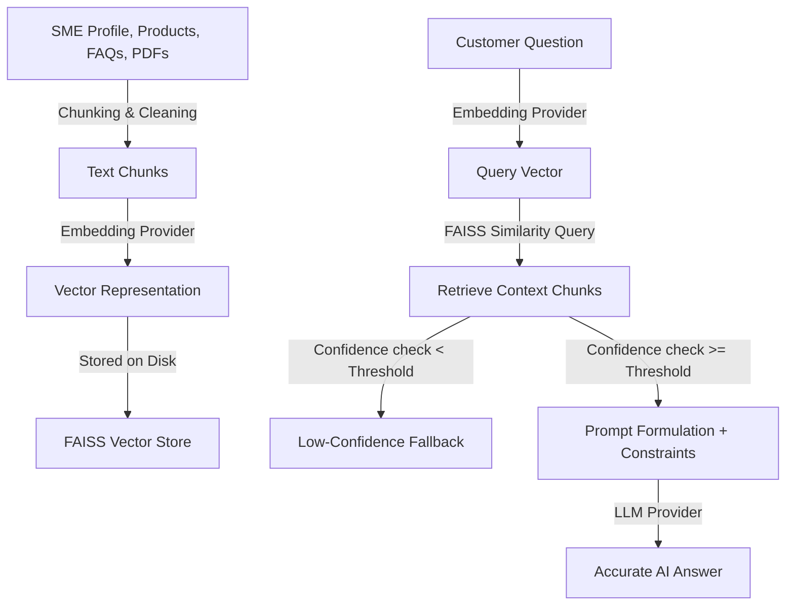

# EasyBiz AI: AI-Powered Customer Support & RAG Assistant for Ghanaian SMEs

EasyBiz AI is a premium, full-stack enterprise web application designed for Ghanaian Small and Medium Enterprises (SMEs) to automate client service. Business owners can register, manage, and catalog their business profile, product details, services, FAQs, and documents. Customers can then converse with the business through an interactive web chat widget or a WhatsApp integration. The AI assistant uses Retrieval-Augmented Generation (RAG) to fetch context-specific data, providing accurate answers while preventing hallucinations.

---

## 🚀 Key Features

*   **Multi-Business Management**: Manage multiple business profiles from a single dashboard.
*   **Inventory & Catalog Management**: Complete CRUD operations for products and services.
*   **Knowledge Base Uploads**: Upload documents (PDF, DOCX, TXT) and seed customized FAQs.
*   **Dynamic RAG Indexing Pipeline**: Synchronously parse, clean, chunk, and index business data into a FAISS vector store.
*   **Context-Bounded AI Chat Engine**: Generates helpful, precise answers based exclusively on the indexed business context, featuring customizable safety guardrails for medical and legal businesses.
*   **Low-Confidence Fallback & Escalation**: Gracefully handles unknown queries by offering a configurable fallback answer and generating human representative handoff escalations.
*   **Voice Input Support**: Send audio queries to the chatbot with optional offline local transcription (Whisper) or cloud APIs.
*   **WhatsApp Cloud API & Simulation**: Integrates with the official Meta WhatsApp Cloud API webhook, with a built-in interactive green-bubble simulator for staging/demo environments.
*   **Docker Containerization**: Full multi-container orchestration using Docker and docker-compose.

---

## 🛠️ Tech Stack

*   **Frontend**: Next.js 16 (React 19, TypeScript, Tailwind CSS)
*   **Backend**: FastAPI 0.103 (Python 3.11, Uvicorn)
*   **Database**: PostgreSQL / SQLite (SQLAlchemy ORM & Alembic migrations)
*   **Vector Database**: FAISS (Facebook AI Similarity Search)
*   **Embeddings**: Google Gemini (`text-embedding-004`), OpenAI (`text-embedding-3-small`), or Sentence Transformers (`all-MiniLM-L6-v2`)
*   **LLM Providers**: Google Gemini (`gemini-1.5-flash`), OpenAI (`gpt-4o-mini`), or Groq
*   **STT Provider**: Local Whisper / Mock Speech-to-Text Abstraction

---

## 📂 Project Structure

```text
EasyBiz-ai/
  backend/                  # FastAPI Application
    app/
      auth/                 # User registration, login, JWT security
      businesses/           # SME profiles
      products/             # Product catalog models and routes
      services/             # Service inventory models and routes
      faqs/                 # FAQ models, routes, CSV bulk import
      documents/            # PDF/DOCX document text extraction and routes
      chat/                 # Chat sessions, messages, human handoffs, WhatsApp routes
      rag/                  # Text splitters, FAISS vector store, indexing pipeline
      ai_providers/         # Abstracted LLM and Embedding provider mappings
      speech_providers/     # Speech-to-Text providers (Whisper/Mock)
      database/             # SessionLocal, database engine, seeds
    Dockerfile              # Backend multi-stage Docker build
    requirements.txt        # Backend dependencies
    test_auth.py            # Authentication integration tests
    test_business.py        # Business CRUD integration tests
    test_products_services.py # Inventory CRUD integration tests
    test_faqs.py            # FAQ CRUD integration tests
    test_phase14.py         # WhatsApp webhook integration tests
    test_manual_flows.py    # Automated manual checklist flow tests
    evaluate_ai.py          # AI accuracy and RAG evaluation module
  frontend/                 # Next.js Application
    app/                    # Next.js App Router Pages
      b/[businessId]/chat/  # Public customer web chat layout
      dashboard/            # Dashboard panels (Business, Products, FAQs, Documents, Chat History)
      login/                # Login form
      register/             # User sign up form
    services/               # API clients for communication with FastAPI backend
    Dockerfile              # Next.js production build setup
  docker-compose.yml        # Multi-container orchestration (App + Postgres)
```

---

## 📖 Choosing Your AI Mode

EasyBiz AI is built on a provider abstraction that is configurable via `backend/.env`:

### 1. Cloud API AI Mode (Google Gemini Default)
High quality, production-grade output using managed cloud models (Google Gemini API):
*   Set environment variables in `backend/.env`:
    ```ini
    AI_MODE=api
    AI_API_PROVIDER=gemini
    GEMINI_API_KEY=your_gemini_api_key
    AI_LLM_MODEL=gemini-1.5-flash
    AI_EMBED_MODEL=text-embedding-004
    ```

### 2. Fallback Mock AI Mode
For local development and offline testing without API charges, use the mock fallback:
*   Set environment variables:
    ```ini
    AI_MODE=mock
    ```

---

## 🔍 Understanding the RAG Pipeline

EasyBiz AI employs **Retrieval-Augmented Generation (RAG)** to guarantee factual responses:



---

## ⚙️ Setup & Installation

### 1. Prerequisites
*   Python 3.10 or 3.11
*   Node.js 18 or 20
*   PostgreSQL or SQLite
*   Docker (Optional, for containerized running)

### 2. Manual Local Setup

#### Start the Backend:
1.  Navigate to `backend/`:
    ```bash
    cd backend
    ```
2.  Create and activate virtualenv:
    ```bash
    python -m venv venv
    .\venv\Scripts\activate # On Unix: source venv/bin/activate
    ```
3.  Install dependencies:
    ```bash
    pip install -r requirements.txt
    ```
4.  Copy `.env.example` to `.env` and configure credentials.
5.  Seed database (Michy's Tech Hub, MelTech Computers, Grace Academy, Akwaaba Restaurant):
    ```bash
    python app/database/seed.py
    ```
6.  Start development server:
    ```bash
    uvicorn app.main:app --reload --port 8000
    ```

#### Start the Frontend:
1.  Navigate to `frontend/`:
    ```bash
    cd ../frontend
    ```
2.  Install dependencies:
    ```bash
    npm install
    ```
3.  Copy `.env.example` to `.env.local`:
    ```bash
    cp .env.example .env.local
    ```
4.  Run Next.js dev server:
    ```bash
    npm run dev
    ```
5.  Access [http://localhost:3000](http://localhost:3000)

---

## 🧪 Testing & Evaluation

Run the automated test suite locally to verify code correctness:

```bash
cd backend
# 1. Run CRUD & Flow Integration tests
python test_auth.py
python test_business.py
python test_products_services.py
python test_faqs.py
python test_phase14.py
python test_manual_flows.py

# 2. Run AI RAG Evaluation Suite (Calculates response accuracy and retrieval score)
python evaluate_ai.py
```

---

## 🐳 Docker Deployment Setup

We provide standard Docker configurations to launch the entire project instantly.

### docker-compose Orchestration
1.  Configure the environment variables in `docker-compose.yml` or `.env`.
2.  Build and start the multi-container stack:
    ```bash
    docker-compose up --build -d
    ```
3.  Initialize the database tables and sample profiles inside the container:
    ```bash
    docker-compose exec backend python app/database/seed.py
    ```
4.  Access the web console at [http://localhost:3000](http://localhost:3000) and the backend documentation at [http://localhost:8000/docs](http://localhost:8000/docs).

---

## 🛡️ Environment Variables Directory

| Variable | Description | Default |
| :--- | :--- | :--- |
| `PORT` | Backend server execution port | `8000` |
| `DATABASE_URL` | SQLAlchemy connector string | `sqlite:///./easybiz.db` |
| `JWT_SECRET` | Secret token signing key | `super_secret_key...` |
| `AI_MODE` | Active AI provider framework (`mock` / `local` / `api`) | `mock` |
| `RAG_CONFIDENCE_THRESHOLD` | Minimum similarity score required to trust RAG context | `0.50` |
| `STT_PROVIDER` | Active Speech-To-Text module (`mock` / `local` / `api`) | `mock` |
| `WHATSAPP_MODE` | WhatsApp router mode (`disabled` / `simulation` / `cloud_api`) | `simulation` |
| `WHATSAPP_VERIFY_TOKEN` | Verification handshake token used by Meta Webhooks | `easybiz_verify_token_2026` |

---

## 🌐 Production Deployment on VPS

To deploy EasyBiz AI on a virtual private server (e.g. DigitalOcean, Linode, AWS):

1.  **Configure PostgreSQL**: Host a managed PostgreSQL database or install Postgres on the VPS and configure `DATABASE_URL`.
2.  **Setup SSL**: Use Nginx as a reverse proxy with Let's Encrypt (Certbot) to redirect traffic from domains `api.yourdomain.com` (to port 8000) and `yourdomain.com` (to port 3000) over SSL/HTTPS.
3.  **Run with Systemd**: Run FastAPI backend using `gunicorn` with uvicorn workers managed by Systemd:
    ```ini
    [Service]
    ExecStart=/home/ubuntu/EasyBiz-ai/backend/venv/bin/gunicorn -w 4 -k uvicorn.workers.UvicornWorker app.main:app -b 127.0.0.1:8000
    ```
4.  **Meta Developer Webhook Setup**: Points the Callback URL in the App Dashboard to `https://api.yourdomain.com/webhooks/whatsapp` using your verified verification token.