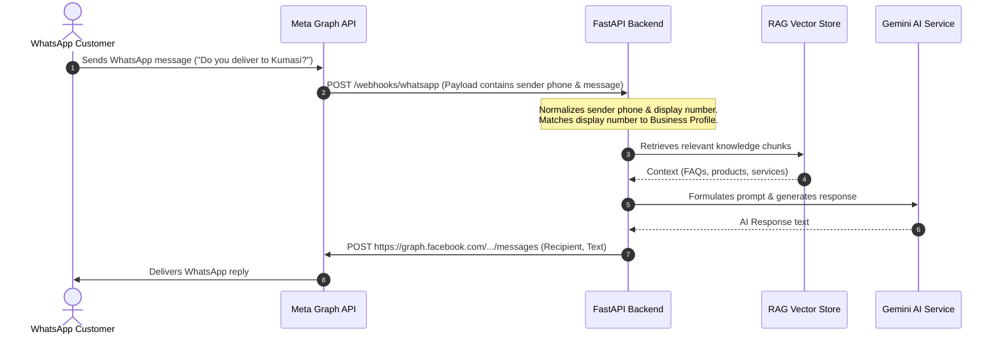

# Phase 14 Documentation: WhatsApp Webhook & Cloud API Integration

This document tracks the setup, architectural components, environment configurations, and validation procedures for **Phase 14: WhatsApp Integration** of EasyBiz AI.

EasyBiz AI provides two flexible modes for WhatsApp:
1. **Simulation Mode (`simulation`)**: A green-bubble simulated web client interface matching WhatsApp's UI. This allows rapid testing of RAG responses, custom products, FAQs, and human handoffs locally without any Meta credentials or external tunnels.
2. **Cloud API Mode (`cloud_api`)**: Connection to the official Meta WhatsApp Cloud API via secure webhooks and graph API endpoints.

---

## 1. Option A: Using the Local WhatsApp Simulator (Instant Testing)

To test the AI chatbot using the built-in simulator (no Meta Account required):

1. **Configure Environment**:
   Ensure `WHATSAPP_MODE=simulation` is set in your `backend/.env` file:
   ```env
   WHATSAPP_MODE=simulation
   WHATSAPP_VERIFY_TOKEN=easybiz_verify_token_2026
   ```
2. **Start Backend & Frontend**:
   Run both servers.
3. **Navigate to the Simulator**:
   * Log into the EasyBiz AI dashboard.
   * Go to **WhatsApp** in the sidebar.
   * Click **Launch Client Simulator** or navigate to `/dashboard/whatsapp/simulate`.
4. **Chat**:
   Type messages into the chat bubble. The simulator sends payloads with `channel = whatsapp_simulation` to the backend, which processes them using standard RAG contexts and logs them under the active business profile.

---

## 2. Option B: Setting up the Official Meta WhatsApp Cloud API (Production/Staging)

To route real WhatsApp messages to and from a customer's phone using the Meta WhatsApp Cloud API:

### Step 1: Create a Meta Developer App
1. Go to the [Meta for Developers Portal](https://developers.facebook.com/).
2. Log in with your Facebook account and click **My Apps** -> **Create App**.
3. Select **Other** -> **Next**.
4. Select **Business** as the app type.
5. Provide an App Name (e.g., `EasyBiz AI Integration`) and associate it with a Facebook Business Account if you have one (or create a new business portfolio). Click **Create App**.

### Step 2: Add WhatsApp to your App
1. Inside the Meta App Dashboard, scroll down to **Add products to your app** and find **WhatsApp**.
2. Click **Set up**.
3. Under the **WhatsApp** menu in the sidebar, click **API Setup**.
4. Meta will generate a **Temporary Access Token** (valid for 24 hours) and provide a **Phone Number ID** (e.g., `109283746562910`) and a test phone number.

### Step 3: Run Ngrok for Local Development Webhooks
Meta's webhook servers require a publicly accessible `https` URL. If running locally, you must tunnel your FastAPI backend port (`8000`).

1. Install [ngrok](https://ngrok.com/) if you haven't already.
2. Open a terminal and run:
   ```bash
   ngrok http 8000
   ```
3. Copy the forwarding HTTPS URL (e.g., `https://a1b2-34-56-78-90.ngrok-free.app`).

### Step 4: Configure Webhooks in the Meta Developer Portal
1. In the Meta App Dashboard, go to **WhatsApp** -> **Configuration** in the left menu.
2. Click **Edit** next to **Webhook**.
3. Fill in the fields:
   * **Callback URL**: Paste your Ngrok URL followed by `/webhooks/whatsapp`.
     * Example: `https://a1b2-34-56-78-90.ngrok-free.app/webhooks/whatsapp`
   * **Verify Token**: Input the token specified in your `backend/.env` file.
     * Example: `easybiz_verify_token_2026`
4. Click **Verify and Save**. Meta will send a `GET` handshake request to your endpoint, which returns the challenge code if the tokens match.
5. Under **Webhook Fields**, find **messages** and click **Subscribe**. (This is critical to receive messages!).

### Step 5: Configure Backend Environment Variables
Update the `backend/.env` file to activate the live webhook router:
```env
# Switch WhatsApp mode to live Cloud API
WHATSAPP_MODE=cloud_api

# Handshake token configured in Meta Developer Console
WHATSAPP_VERIFY_TOKEN=easybiz_verify_token_2026

# Meta Credentials from App Dashboard API Setup
WHATSAPP_PHONE_NUMBER_ID=your_meta_phone_number_id
WHATSAPP_ACCESS_TOKEN=your_meta_access_token

# Optional: default mapping business number
WHATSAPP_BUSINESS_NUMBER=+233249999999
```
*Note: Restart your FastAPI Uvicorn server after updating the `.env` file.*

---

## 3. How the WhatsApp Message Pipeline Works

When a WhatsApp customer sends a message:


### Phone Number Matching Rules
When an incoming webhook payload arrives, the backend determines which business profile the message belongs to using `backend/app/chat/whatsapp_routes.py#get_business_by_whatsapp()`:
1. **Direct `whatsapp_number` Match**: Normalizes all phone numbers in the database and checks if the display number in the webhook matches a registered Business's `whatsapp_number`.
2. **Direct `phone` Match**: Checks if the display number matches a registered Business's standard contact `phone`.
3. **Environment Fallback**: If no direct match is found, it checks if `WHATSAPP_BUSINESS_NUMBER` in the env matches any business profile.
4. **Final Fallback**: If all else fails, it routes the message to the first business profile in the database so the chat doesn't break.

---

## 4. Verification via Integration Tests

An automated script simulates Meta's webhook handshake and message payload to ensure your FastAPI routes, SQLAlchemy models, and RAG pipelines are fully functional.

### Run Webhook Integration Test
Make sure the backend server is running on `http://127.0.0.1:8000` (or update `API_URL` in the script), then execute:

```powershell
# Navigate to the backend folder
cd backend

# Execute using python in the virtual environment
.\venv\Scripts\python.exe test_phase14.py
```

### Expected Output
```text
Cleaning database of old test WhatsApp data...
[OK] Cleaned 1 conflicting test business profiles.
=== STARTING PHASE 14 (WHATSAPP WEBHOOK) INTEGRATION TESTS ===

1. Setting up test user: owner_wa_1234@easybiz.ai
[OK] User set up and token obtained.

2. Testing Business Profile Creation with whatsapp_number
[OK] Business profile successfully created! ID: aa9d6e4b-84a1-432d-9658-001bc283cd5c

3. Testing GET /webhooks/whatsapp verification handshake...
GET handshake response status: 200
GET handshake response body: verify_challenge_token_abc_123
[OK] GET verification handshake passed!

4. Testing POST /webhooks/whatsapp incoming message processing...
[WhatsApp SIMULATION] Sending reply to 233245555555: 'Yes, we deliver to Kumasi using courier services...'
POST status: 200
[OK] Webhook POST processed successfully!

5. Verifying DB insertion of chat session and messages via API...
[OK] WhatsApp ChatSession created successfully: d8d7e008-8e6f-4422-b5e1-8898b68832a8
[OK] Customer message logged: 'Do you deliver to Kumasi?'
[OK] AI Response generated and logged: 'Yes, we deliver to Kumasi...'

=======================================================
[SUCCESS] ALL PHASE 14 BACKEND INTEGRATION TESTS PASSED!
=======================================================
```

---

## 5. Staging & Production Hosting Considerations

When deploying EasyBiz AI to a cloud host (such as Render, Railway, AWS, DigitalOcean, or Heroku), make sure you satisfy the following requirements to ensure your live WhatsApp integration functions seamlessly:

### 1. Upgrade to a Permanent Access Token
The access token generated in the App Dashboard is a temporary developer token that expires in **24 hours**. 
* **For Production:** You must set up a Meta Business Manager portfolio, create a **System User** (under Business Settings), and generate an access token with the `whatsapp_business_messaging` permission. This token does not expire.

### 2. Update the Webhook Callback URL
Once hosted, you will no longer use Ngrok:
* In the Meta App Developer console, change the Callback URL to your production domain:
  * e.g., `https://api.yourdomain.com/webhooks/whatsapp` (Note: Meta requires HTTPS/SSL).
* Ensure that the `WHATSAPP_VERIFY_TOKEN` configured in your hosting environment matches the Verify Token in the Meta App console.

### 3. Move from Test Numbers to a Real Phone Number
* Under the App's **WhatsApp -> API Setup** menu, link a real phone number to your WhatsApp Business Account.
* **Important:** The phone number must NOT be currently registered on a personal WhatsApp or WhatsApp Business mobile app. If it is, you must delete that account from the mobile app first to allow Meta's Cloud API to claim it.

### 4. Enable Production CORS and Domains
* Update the `CORS_ORIGINS` environment variable on your hosted backend to include the production frontend URL (e.g. `https://easybiz-frontend.com` instead of `http://localhost:3000`).

### 5. Persistent FAISS / Database Storage
* Since RAG uses FAISS vector stores locally, ensure your hosting provider maps a persistent disk/volume to `/app/vector_indices` or use a backend database replication strategy. Otherwise, restarting your server container might delete the loaded knowledge base.

