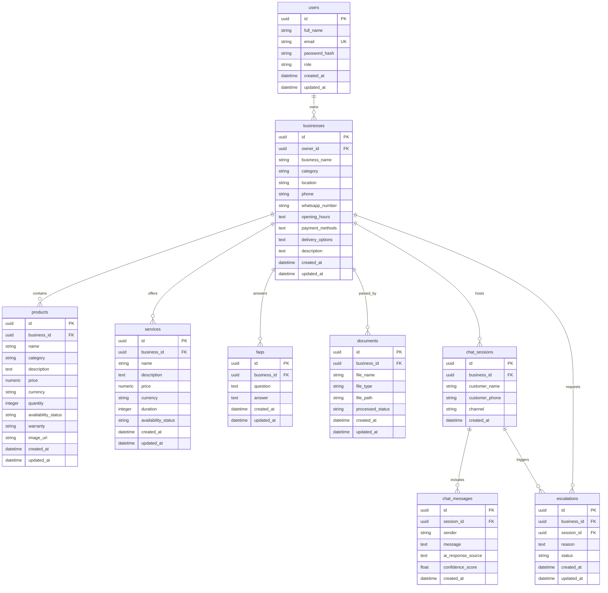

# Phase 2 Documentation: Database Design & Backend Models

This document tracks the deliverables, schema designs, and verification guides for **Phase 2: Database Design and Backend Models** of EasyBiz AI.

---

## Objectives Completed
1.  **Database Connection Management:** Setup session configuration (`session.py`) that loads `DATABASE_URL` from the environment. Automatically formats standard postgresql URLs to use the pure-Python driver (`postgresql+pg8000://`) and supports local SQLite fallback (`sqlite:///./easybiz.db`) to ease local development and testing.
2.  **Modular Database Models:** Developed clean SQLAlchemy 2.0 models using UUIDs for primary/foreign keys and relationships with cascade deletes across:
    *   `User`: Owner and staff accounts.
    *   `Business`: SME metadata profiles.
    *   `Product`: Retailable store items.
    *   `Service`: Retail services and durations.
    *   `FAQ`: Quick query response pairs for the chatbot.
    *   `Document`: Trace metadata for uploaded training files (PDF, CSV, TXT).
    *   `ChatSession`, `ChatMessage`, and `Escalation`: Conversation states, message records with confidence scoring, and human handoff tracking.
3.  **Circular Import Resolution:** Extracted SQLAlchemy's declarative base to a separate file `base_class.py` while registry imports are located in `base.py`, resolving import dependency loops on runtime load.
4.  **Database Seeding Script:** Added a script (`seed.py`) populating the database with a sample Ghanaian SME (electronics shop "Michy's Tech Hub" located at Adum, Kumasi) with products, services, and FAQs.
5.  **Alembic Migrations Configuration:** Initialized Alembic and successfully generated and ran autogenerated migration revision scripts.
6.  **Application Integration & Live Health Check:** Configured FastAPI app startup to initialize tables automatically if missing, and upgraded the `/health` endpoint with a live `SELECT 1` connectivity query.

---

## Database Architecture (ER Diagram)



---

## File Structure Scaffolded in Phase 2

```text
EasyBiz-ai/
  backend/
    alembic/            # Alembic migration environments
      versions/         # Generated migration scripts
      env.py            # Dynamic DB connection binding
    app/
      auth/
        models.py       # [NEW] User database model
      businesses/
        models.py       # [NEW] Business database model
      products/
        models.py       # [NEW] Product database model
      services/
        models.py       # [NEW] Service database model
      faqs/
        models.py       # [NEW] FAQ database model
      documents/
        models.py       # [NEW] Document database model
      chat/
        models.py       # [NEW] ChatSession, ChatMessage, and Escalation models
      database/
        base_class.py   # [NEW] Holds declarative Base metadata class
        base.py         # [NEW] Unified schema model registry
        session.py      # [NEW] SQLAlchemy engine config & get_db dependency
        seed.py         # [NEW] Sample data populator script
      main.py           # startup create_all & live health routes
    alembic.ini         # Database migration configuration file
    requirements.txt    # requirements with SQLAlchemy 2.0.51 & Pydantic 2.13.4
  docs/
    PHASE_2_README.md   # Phase 2 Documentation (This file)
```

---

## Verification Guide

To verify Phase 2 setup using a local SQLite fallback:

### 1. Configure the Environment
Ensure your `backend/.env` file contains:
```bash
DATABASE_URL=sqlite:///./easybiz.db
```

### 2. Generate and Apply Schema Migrations
```bash
cd backend
# Generate migration script
.\venv\Scripts\alembic.exe revision --autogenerate -m "Initial migration"

# Apply migration schemas locally
.\venv\Scripts\alembic.exe upgrade head
```
This generates the SQLite file `easybiz.db` inside your `backend/` directory.

### 3. Seed Sample SME Data
Run the seeding script to populate the local database:
```bash
.\venv\Scripts\python.exe -m app.database.seed
```
*Expected Output:*
```
Seeding database...
Database successfully seeded with Michy's Tech Hub sample data!
```

### 4. Verify Server Health Check
Run the backend web app:
```bash
.\venv\Scripts\python.exe -m app.main
```
Open a terminal and query the `/health` endpoint:
```powershell
Invoke-RestMethod -Uri http://localhost:8000/health
```
*Expected JSON Response:*
```json
{
  "status": "healthy",
  "database": "connected",
  "ai_provider": "mocked_mock_ok",
  "timestamp": "2026-06-23T14:39:04.393473Z"
}
```
*(Notice that `"database": "connected"` indicates the system successfully performed a query against your database on route request.)*
