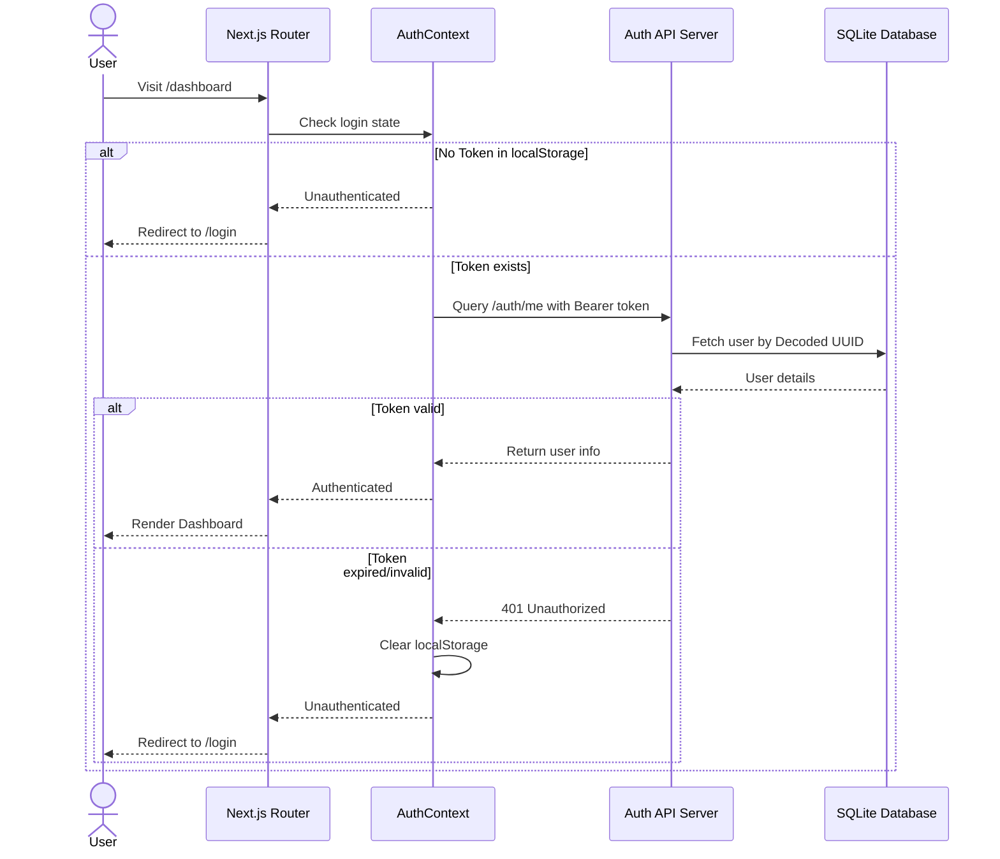

# Phase 3 Documentation: Authentication & User Management

This document tracks the deliverables, implementation architectures, file trees, and verification steps for **Phase 3: Authentication and User Management** of EasyBiz AI.

---

## Objectives Completed

1. **Secure Password Hashing:** Configured secure, salted password hashing using `bcrypt` to hash and verify credentials before commit or authentication.
2. **Strict Registration Constraints:**
   - Client-side and backend email format validations.
   - Prevention of duplicate email records (returns clean `400 Bad Request` messages).
   - Role-based user accounts with constraints validating specific inputs (`admin`, `business_owner`, `staff`) default-bound to `business_owner`.
3. **JWT Authentication Flow:**
   - Stateless JWT access tokens signed with `HS256` using custom environment expiration times.
   - FastAPI dependencies checks (`get_current_user`) to authenticate incoming bearer tokens and inject active database rows into protected endpoints.
4. **Unified Frontend State & Guards:**
   - Created React Context state client (`AuthContext.tsx`) that reads and caches auth tokens inside `localStorage`.
   - Setup global route guards checks that redirect unauthorized sessions trying to access `/dashboard` to `/login`, and redirects logged-in clients away from `/login` or `/register` to `/dashboard`.
5. **Polished Auth UI Templates:**
   - Created beautifully styled, dark-themed responsive pages for **Register**, **Login**, and the **Control Console (Dashboard)** using Tailwind CSS v4, matching the layout system of the initial homepage.
   - Added conditional navbar links and buttons on the landing page based on authentication states.

---

## Authentication State Flow



---

## File Structure Scaffolded in Phase 3

```text
EasyBiz-ai/
  backend/
    app/
      auth/
        models.py       # User database model schema
        routes.py       # POST register, login, GET me, POST logout endpoints
        security.py     # Hashing logic, JWT generation, get_current_user dependencies
    test_auth.py        # [NEW] Backend endpoints verification test suite
  frontend/
    app/
      dashboard/
        page.tsx        # [NEW] Protected Control Panel Dashboard
      login/
        page.tsx        # [NEW] Premium credentials form view
      register/
        page.tsx        # [NEW] Premium registration form view
      layout.tsx          # Wrapped with global AuthProvider context
      page.tsx            # Home view updated with auth redirections
    context/
      AuthContext.tsx   # [NEW] Global state management & client-side route guards
    services/
      auth.ts           # [NEW] API helper client requests to backend auth routes
```

---

## Verification Guide

To verify Phase 3 authentication and pages locally:

### 1. Setup Local Environment
Ensure the backend `.env` file uses SQLite local database path:
```bash
DATABASE_URL=sqlite:///./easybiz.db
```

Ensure the frontend `.env.local` file references the backend URL:
```bash
NEXT_PUBLIC_API_URL=http://localhost:8000
```

### 2. Run Backend Integration Tests
Start the backend server and execute the custom automated verification suite:
```bash
# In backend directory
.\venv\Scripts\python.exe test_auth.py
```
This tests registration constraints (bad emails, invalid roles, duplicate entries), login, JWT extraction, profile retrieval on protected routes, and logouts.

### 3. Start Development Servers
Start both backend and frontend servers:

**Backend:**
```bash
cd backend
.\venv\Scripts\python.exe -m app.main
```

**Frontend:**
```bash
cd frontend
npm run dev
```

### 4. Perform Manual Interface Checks
Open [http://localhost:3000](http://localhost:3000) in your web browser:
1. **Unauthenticated Redirect:** Try accessing [http://localhost:3000/dashboard](http://localhost:3000/dashboard) directly. You should be redirected back to the `/login` page immediately.
2. **Registration:** Click "Register" in the header. Try submitting with an invalid email or a short password (< 6 characters) to test validation messages. Create a new account with valid details.
3. **Auto-Login:** On registration success, you will be automatically logged in and redirected directly to the Dashboard console showing your user name, email, and role badge.
4. **Authenticated State:** Navigate back to the homepage [http://localhost:3000](http://localhost:3000). The homepage header should now show "Console" and "Logout" buttons, and the main call-to-action button should read "Go to Dashboard".
5. **Access Protection:** While logged in, try navigating back to `/login` or `/register` manually. The client route guards will redirect you back to `/dashboard`.
6. **Logout:** Click "Logout" on the Dashboard. You will be signed out and redirected to `/login`. Direct access checks to `/dashboard` will once again block entry.
