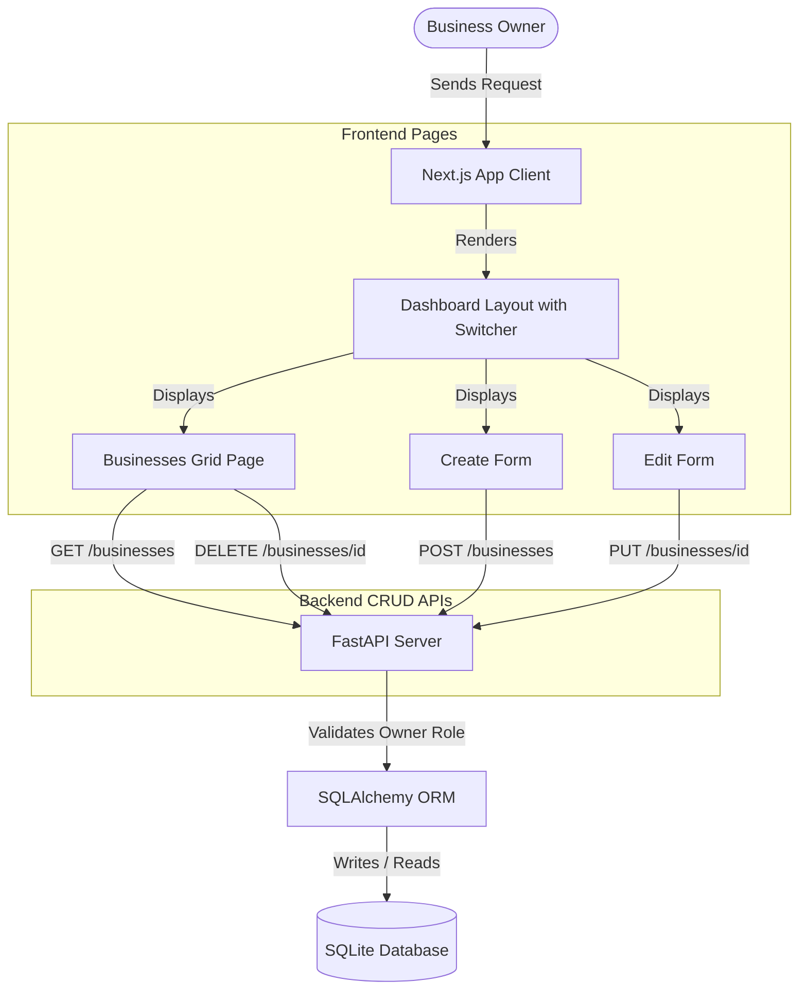

# Phase 4 Documentation: Business Profile Management

This document tracks the deliverables, schema setups, layout integrations, and verification procedures for **Phase 4: Business Profile Management** of EasyBiz AI.

---

## Objectives Completed

1. **Backend Business CRUD API:**
   - Designed database CRUD endpoints routing under the `/businesses` prefix.
   - Associated business profiles with owners (`owner_id` ForeignKey).
   - Configured route protections restricting updates (`PUT`) or deletions (`DELETE`) strictly to the business profile owner or admin accounts.
   - Validated required fields: `business_name`, `category`, `location`, `phone`.
2. **Global Frontend Business Selector Context:**
   - Modified `AuthContext.tsx` to automatically load owned business profiles on login or mount.
   - Maintained global state for `activeBusiness` (defaulting to the first business profile or `null` if none exist) and cached it across sessions using `localStorage`.
3. **Structured Admin Sidebar Layout:**
   - Created a modular dashboard layout structure (`layout.tsx`) that mounts a left-hand navigation sidebar.
   - Navigation links implemented: Dashboard, Businesses, Products (Locked), Services (Locked), FAQs (Locked), Documents (Locked), Chat Test (Locked), Chat History (Locked), Settings (Locked).
   - Designed a global Active Business selector dropdown in the navbar header, letting users toggle their managed SME context at any point.
   - Built hamburger menus for mobile responsive screens.
4. **Business Profile Management Interface:**
   - **Zero-State Onboarding:** Renders clear calls to action prompting users to create profiles if they have none.
   - **List View (`/dashboard/businesses`):** Displays cards for all user-owned businesses with activation badges, edit routes, and delete prompts.
   - **Setup Form (`/dashboard/businesses/create`):** Validates inputs before executing creation requests.
   - **Edit Form (`/dashboard/businesses/[id]/edit`):** Dynamically unwraps path parameters to load current values and save changes.

---

## CRUD Architecture Flow



---

## File Structure Scaffolded in Phase 4

```text
EasyBiz-ai/
  backend/
    app/
      businesses/
        routes.py       # [NEW] Businesses CRUD routes & pydantic schemas
        models.py       # SQLAlchemy Business database model
    test_business.py    # [NEW] Business CRUD automated verification tests
  frontend/
    app/
      dashboard/
        businesses/
          [id]/
            edit/
              page.tsx  # [NEW] Edit Business profile page
          create/
            page.tsx    # [NEW] Setup Business profile page
          page.tsx      # [NEW] Manage Business profiles page
        layout.tsx      # [NEW] Dashboard layout structure & sidebar nav
        page.tsx        # Dashboard home main workspace details
    services/
      business.ts       # [NEW] API helper client requests to backend businesses routes
```

---

## Verification Guide

To verify Phase 4 business profiles CRUD locally:

### 1. Run Automated Endpoint Verification
Verify backend validations (missing field rejections, unauthorized user constraints, and successful updates/deletions) by executing the Python suite:
```bash
# In backend/ directory
.\venv\Scripts\python.exe test_business.py
```
*Expected Output:*
```text
=== STARTING BUSINESS CRUD INTEGRATION TESTS ===

1. Setting up test user: owner_biz_1988@easybiz.ai
[OK] User set up and token obtained.

2. Testing Business Profile Creation
Response status: 201
[OK] Business profile successfully created! ID: 04b1b7b5-a88b-4b28-a89a-47e7e2504c93

...
=======================================================
[SUCCESS] ALL BUSINESS CRUD INTEGRATION TESTS PASSED!
=======================================================
```

### 2. Manual Browser Testing
Start both development servers (Backend `python -m app.main` and Frontend `npm run dev`) and navigate to [http://localhost:3000](http://localhost:3000):

1. **Create First Profile:**
   - Log in. The dashboard page will show a "No Business Profiles Found" zero-state.
   - Click "Create Business Profile" to go to `/dashboard/businesses/create`.
   - Submit a profile (e.g. *Kojo's Tech Hub*, category *Electronics Retail*, location *Adum, Kumasi*, phone *+233241112222*).
   - Upon submission, you will be redirected to the Businesses page.
2. **Verify Global Selectors:**
   - Notice that the new business is automatically marked as "Active" and displays in the sidebar header's selector dropdown.
   - Navigate to the Dashboard home route. The Welcome card now displays full details for *Kojo's Tech Hub* instead of the zero-state.
3. **Register Additional Businesses:**
   - Go to `/dashboard/businesses` and click "+ Add New Business". Create a second profile (e.g. *Kumasi Bakery*).
   - In the sidebar dropdown, switch between *Kojo's Tech Hub* and *Kumasi Bakery*.
   - Verify that the Dashboard stats reflect the properties of whichever business is currently selected.
4. **Edit Business Profile:**
   - On the Businesses page, click the pencil/edit icon on a profile card.
   - Modify fields (e.g. update Location or Description) and click "Save Changes".
   - Verify that the details update correctly in the listings and selector contexts.
5. **Delete Business Profile:**
   - On the Businesses page, click the trash/delete icon on one of your profiles.
   - Accept the confirmation dialog. Verify that the profile disappears from the listings and dropdown options.
