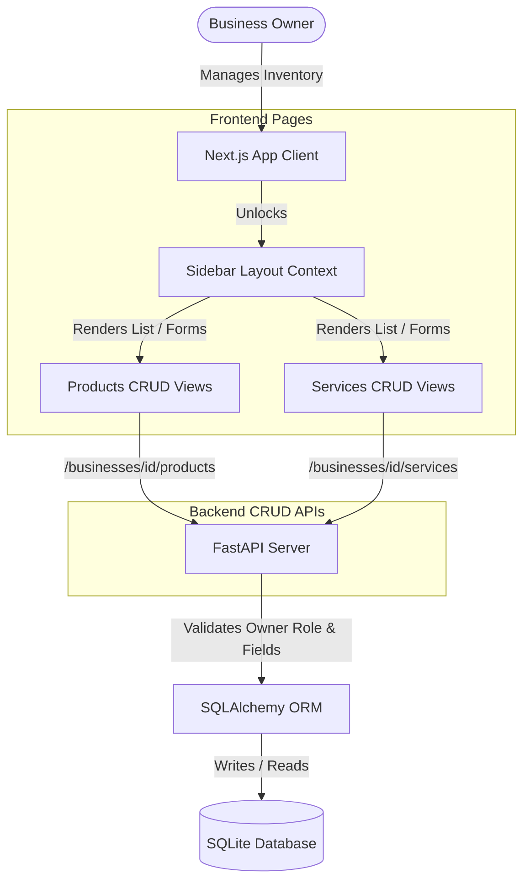

# Phase 5 Documentation: Product & Service Management

This document tracks the deliverables, schema setups, layout integrations, and verification procedures for **Phase 5: Product & Service Management** of EasyBiz AI.

---

## Objectives Completed

1. **Backend Product & Service CRUD APIs:**
   - Designed database CRUD endpoints for products and services.
   - Connected products and services to their respective business profiles using foreign keys.
   - Enforced route protections restricting management access strictly to the business profile owner, staff, or admin accounts.
   - Configured input validations: product prices and quantities must be non-negative, and service prices and durations must be positive/non-negative.

2. **Dashboard Layout Unlocking:**
   - Updated the main navigation sidebar layout (`layout.tsx`) by removing placeholders, unlocking the **Products** and **Services** panels for active business profiles.

3. **Product Cataloguing Interface:**
   - **List/Stock Table:** View all products with category, price, quantity, warranty, and availability flags. Includes quick-click stock toggles to switch items between `available` and `out_of_stock`.
   - **Add/Edit Forms:** Validates name, price, quantity, and warranty before creation/update.

4. **Service Offerings Interface:**
   - **List/Duration Table:** Lists business services, duration in minutes, and booking prices.
   - **Add/Edit Forms:** Validates service duration and details before committing changes.

5. **Automated Testing Suite:**
   - Implemented `test_products_services.py` containing complete integration tests to verify database constraints, validation handling, permissions checking, and full CRUD operations.

---

## CRUD Architecture Flow



---

## File Structure Scaffolded in Phase 5

```text
EasyBiz-ai/
  backend/
    app/
      products/
        routes.py       # Pydantic schemas & routes for Product CRUD
        models.py       # Product SQLAlchemy database model
      services/
        routes.py       # routes for Service CRUD
        models.py       # Service SQLAlchemy database model
    test_products_services.py # [NEW] Product & Service CRUD integration test suite
  frontend/
    app/
      dashboard/
        products/
          [id]/
            edit/
              page.tsx  # [NEW] Edit Product details page
          create/
            page.tsx    # [NEW] Add Product details page
          page.tsx      # [NEW] Products catalog listing page
        services/
          [id]/
            edit/
              page.tsx  # [NEW] Edit Service details page
          create/
            page.tsx    # [NEW] Add Service details page
          page.tsx      # [NEW] Services catalog listing page
    services/
      product.ts        # API fetch wrapper client for products
      service.ts        # API fetch wrapper client for services
  docs/
    PHASE_5_README.md   # Phase 5 Documentation (This file)
```

---

## Verification Guide

To verify Phase 5 product and service flows locally:

### 1. Run Automated Test Suite
Run the Python script to verify all database validations (negative numbers check), permissions routing, and CRUD cycles:
```bash
# In backend/ directory
.\venv\Scripts\python.exe test_products_services.py
```
*Expected Output:*
```text
=== STARTING PRODUCTS AND SERVICES CRUD INTEGRATION TESTS ===

1. Setting up test user: owner_prod_4798@easybiz.ai
[OK] User set up and token obtained.
...
=======================================================
[SUCCESS] ALL PRODUCTS & SERVICES CRUD TESTS PASSED!
=======================================================
```

### 2. Manual Browser Testing
Start development servers (Backend `python -m app.main` and Frontend `npm run dev`) and navigate to [http://localhost:3000](http://localhost:3000):

1. **Verify Sidebar Unlocking:**
   - Log in. Notice that **Products** and **Services** are now unlocked in the sidebar (the lock icon is removed, and they are clickable).
2. **Add Products:**
   - Click **Products** in the sidebar. Since you have no products, you will see the zero state.
   - Click "+ Register First Product" to navigate to `/dashboard/products/create`.
   - Try inputting a negative price (e.g. `-10`) or a negative quantity (e.g. `-5`). Submit and verify that the form rejects it.
   - Input valid details (e.g. name: *HP EliteBook 840 G6*, price: *4200.00*, quantity: *10*, availability: *available*). Submit the form.
   - Verify that the product displays correctly in the list.
3. **Toggle Stock and Edit:**
   - Click the green "available" badge in the table. Verify that it toggles to "out_of_stock" and sets the quantity indicator appropriately.
   - Click the pencil edit icon for your product to navigate to the editing view.
   - Edit the description or price and click "Save Changes". Confirm it updates on the listing page.
4. **Manage Services:**
   - Click **Services** in the sidebar. Click "+ Register First Service" to navigate to `/dashboard/services/create`.
   - Register a service (e.g. name: *Laptop Diagnostics*, price: *150.00*, duration: *30* minutes).
   - Verify that the service appears in the grid, can be toggled to "unavailable", edited, and deleted successfully.
