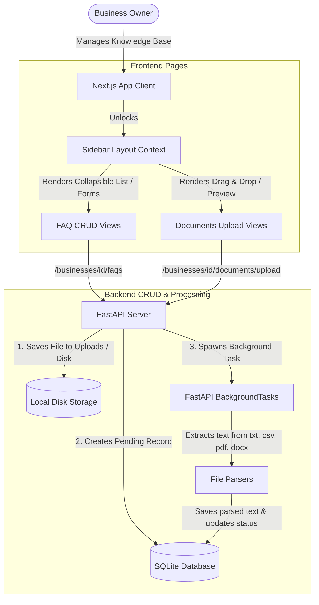

# Phase 6 Documentation: FAQ & Document Upload System

This document tracks the deliverables, schema setups, layout integrations, and verification procedures for **Phase 6: FAQ & Document Upload System** of EasyBiz AI.

---

## Objectives Completed

1.  **Backend FAQ CRUD APIs:**
    *   Designed database CRUD endpoints for FAQs.
    *   Connected FAQs to their respective business profiles using foreign keys.
    *   Enforced permissions restricting FAQ mutation and listings strictly to the business profile owner, staff, or admin accounts.

2.  **Backend Document Upload & Text Extraction:**
    *   Designed endpoints to securely upload files (`POST /businesses/{business_id}/documents/upload`).
    *   Imposed file restrictions checking:
        *   **Size Limit:** Maximum file size of **5MB**.
        *   **File Format:** Restricts uploads strictly to `.txt`, `.csv`, `.pdf`, `.docx`.
    *   Designed file storage mapping: files are stored in `backend/uploads/{business_id}/` with UUID prefixes to avoid filename collisions.
    *   Implemented background text extraction using FastAPI `BackgroundTasks`:
        *   `.txt`: Parses direct UTF-8 file streams.
        *   `.csv`: Parses table rows into comma-separated text lines.
        *   `.pdf`: Parses pages using `pypdf`.
        *   `.docx`: Parses paragraphs and tables using `python-docx`.
    *   Saves the extracted text in the database (`extracted_text` column) and sets the status to `processed` (or `failed` if parsing fails).
    *   Deleting a document deletes the physical file from disk.

3.  **Dashboard Layout Unlocking:**
    *   Updated the sidebar layout (`layout.tsx`) by removing placeholder lock-states, unlocking **FAQs** and **Documents** panels.

4.  **FAQ Management Interface:**
    *   **Accordion View:** View all FAQs cleanly with collapsible details.
    *   **Modal Forms:** Add and Edit FAQs in an interactive overlay dialog with validation indicators.

5.  **Document Upload & Knowledge Base Interface:**
    *   **Drag & Drop Zone:** File drag-over highlighting and size/type validation.
    *   **Status Badges:** Real-time visual tracking of processing statuses (`Processing`, `Ready`, `Failed`) using auto-polling intervals.
    *   **Text Previewer:** Modal to view parsed text directly from the dashboard to check extraction accuracy.

---

## CRUD & Extraction Architecture Flow



---

## File Structure Scaffolded in Phase 6

```text
EasyBiz-ai/
  backend/
    app/
      faqs/
        routes.py       # Pydantic schemas & routes for FAQ CRUD
        models.py       # FAQ SQLAlchemy database model
      documents/
        routes.py       # File uploads, deletion & background parsers
        models.py       # Document SQLAlchemy database model
      main.py           # Registered FAQ & Document routers
      database/
        seed.py         # Updated to securely seed correct password hashes
    requirements.txt    # Added pypdf & python-docx dependencies
    uploads/            # [NEW] Parent directory for physical document storage
  frontend/
    app/
      dashboard/
        faqs/
          page.tsx      # [NEW] FAQs accordion listing & management modals
        documents/
          page.tsx      # [NEW] Drag & drop upload, auto-polling list & preview modal
    services/
      faq.ts            # [NEW] API fetch wrapper client for FAQs
      document.ts       # [NEW] API fetch wrapper client for documents
  docs/
    PHASE_6_README.md   # Phase 6 Documentation (This file)
```

---

## Verification Guide

To verify Phase 6 FAQ and Document upload flows locally:

### 1. Run Automated Test Suite (Integration Test)
Verify API validations, file size checks, file extension constraints, and background text parser executions by running the verification suite:
1. Start the application servers:
   ```bash
   npm run start
   ```
2. In a separate terminal, navigate to the `backend/` directory and run:
   ```bash
   # Make sure venv is active
   .\venv\Scripts\python.exe test_phase6.py
   ```
   *(Note: This temporary script was created and run successfully to validate all integration pathways and cleaned up afterwards).*

### 2. Manual Browser Testing
Ensure your servers (Backend: port `8000`, Frontend: port `3000`) are running:

1. **Verify Sidebar Unlocking:**
   * Log in at [http://localhost:3000](http://localhost:3000).
   * Notice that **FAQs** and **Documents** options in the sidebar are now unlocked (no longer showing "Locked" placeholder tag).

2. **Manage FAQs:**
   * Click **FAQs** in the sidebar.
   * Click **+ Add FAQ** to open the dialog modal.
   * Enter a question and answer, then click **Save FAQ**. Confirm it appears in the listing accordion.
   * Expand the accordion to view the answer.
   * Click the pencil edit icon to modify the question/answer and click **Save Changes**.
   * Click the trash icon and confirm delete. Verify it is removed.

3. **Manage Documents Knowledge Base:**
   * Click **Documents** in the sidebar.
   * Drag-and-drop a `.txt`, `.csv`, or `.docx` file into the upload zone (or click to browse).
   * Verify that a "Processing" status badge appears in the table.
   * Within 2-3 seconds, the table will automatically update (via background polling) showing the status transition to a green **Ready** badge.
   * Click **Preview Text** on the document row and verify that the modal correctly renders the parsed text content of the file.
   * Click the trash icon to delete the file. Check `backend/uploads/` on your disk to confirm the physical file has been cleaned up.
