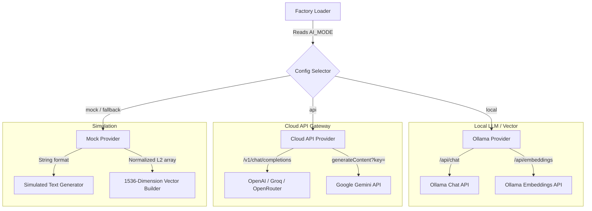

# Phase 7 Documentation: AI Provider Abstraction

This document tracks the architectural details, configurations, and verification procedures for **Phase 7: AI Provider Abstraction** of EasyBiz AI.

---

## Objectives Completed

1.  **AI Base Interfaces:**
    *   Created `BaseLLMProvider` defining `generate_response(prompt, system_prompt)`.
    *   Created `BaseEmbeddingProvider` defining `embed_text(text)` and `embed_batch(texts)`.
    *   This establishes a standard interface for all AI interactions, ensuring the codebase is provider-agnostic.

2.  **AI Provider Implementations:**
    *   **Local Ollama Provider:** Connects to local Ollama API instances via HTTP (`/api/chat` and `/api/embeddings`).
    *   **Cloud API Provider:** Standard HTTP client compatible with OpenAI and OpenAI-compatible platforms (such as Groq, OpenRouter) and native Google Gemini API payloads.
    *   **Fallback Mock Provider:** Generates deterministic mock text and normalize L2 vectors of size `1536` for local testing without cloud credentials or offline dependencies.

3.  **Provider Factory & Fallbacks:**
    *   Implemented `get_llm_provider()` and `get_embedding_provider()` in `factory.py`.
    *   Decides provider type based on `AI_MODE` env variable (`local`, `api`, `mock`).
    *   Catches connection errors or missing credential states and gracefully logs a warning, falling back to the `Mock` provider to prevent application startup crashes.

4.  **Test Endpoints:**
    *   Exposed `POST /ai/test-generate` and `POST /ai/test-embed` routes for checking LLM generation and vector math parsing.

---

## AI Provider Configuration (.env)

Switching between AI operation modes is handled strictly by setting environment variables in `backend/.env`.

### 1. Offline / Local Mode (Ollama)
Configure Ollama locally, then set:
```env
AI_MODE=local
OLLAMA_BASE_URL=http://localhost:11434
OLLAMA_LLM_MODEL=mistral         # (or gemma, llama3, etc.)
OLLAMA_EMBED_MODEL=nomic-embed-text
```

### 2. API Mode (Cloud Services)
Provide your cloud credentials and model definitions:
```env
AI_MODE=api
AI_API_PROVIDER=openai           # (options: openai, gemini, groq, openrouter)
AI_API_KEY=your-api-key-here
AI_API_BASE_URL=                 # (optional: custom endpoint for proxies)
AI_LLM_MODEL=gpt-4o-mini
AI_EMBED_MODEL=text-embedding-3-small
```

### 3. Fallback / Simulation Mode
```env
AI_MODE=mock
```

---

## AI Architecture Flow



---

## Verification Guide

To verify Phase 7 AI routing locally:

### 1. Run Automated Test Route Integration
Launch your servers:
```bash
npm run start
```
Run the test command in a separate terminal:
```bash
# Inside backend/ directory
.\venv\Scripts\python.exe test_phase7.py
```
*Expected Output:*
```text
=== STARTING PHASE 7 (AI PROVIDER ABSTRACTION) INTEGRATION TESTS ===

1. Testing LLM Response Generation (/ai/test-generate)...
Response status: 200
Active Provider Mode: MockLLMProvider
Active Model: mock-model
...
[OK] Generate test successful!

2. Testing Embedding Generation (/ai/test-embed - Single)...
Response status: 200
Active Embedding Provider: MockEmbeddingProvider
Vector dimension: 1536
...
[OK] Single embed test successful!

3. Testing Embedding Generation (/ai/test-embed - Batch)...
Response status: 200
Batch list length: 3
Batch dimension: 1536
[OK] Batch embed test successful!

=======================================================
[SUCCESS] ALL AI PROVIDER ABSTRACTION INTEGRATION TESTS PASSED!
=======================================================
```

### 2. Manual OpenAPI / Swagger Inspection
Navigate to [http://localhost:8000/docs](http://localhost:8000/docs) in your browser:
*   Find the **ai** section containing `/ai/test-generate` and `/ai/test-embed`.
*   Click **Try it out** and test inputs. Verify that responses returned contain the mode details and valid completions/floats array.
