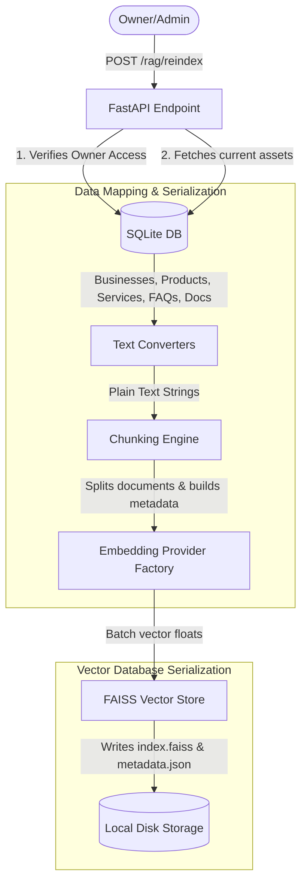

# Phase 8 Documentation: RAG Indexing Pipeline

This document tracks the deliverables, schema mappings, vector DB architectures, and verification procedures for **Phase 8: RAG Indexing Pipeline** of EasyBiz AI.

---

## Objectives Completed

1.  **Modular Vector Store Contract:**
    *   Created `BaseVectorStore` abstract class defining index creation, similarity querying, and deletion contracts.
    *   Implemented `FAISSVectorStore` using the `faiss` library. This saves the binary index (`index.faiss`) and serialized metadata mapping (`metadata.json`) on disk segregated strictly by `business_id` under `backend/vector_indices/{business_id}/`.
    *   Prevents data leakage: querying requires specifying a `business_id`, ensuring a customer talking to business A can never see vectors belonging to business B.

2.  **Structured Text Converters:**
    *   Designed serialization formatters in `text_converters.py` to convert relational models (profile information, products catalog, service offerings, and FAQs) into standardized text blocks optimized for similarity indexing.

3.  **Semantic Chunking & Metadata Mapping:**
    *   Structured products, services, and FAQ items to index as a single chunk.
    *   Programmed a word-overlap segmenter splitting documents (extracted plain text) into chunks of **300 to 500 words** (default: 400 words with 50 words sliding overlap to preserve sentences).
    *   Appended standard metadata payload to each chunk: `business_id`, `source_type` (profile/product/service/faq/document), `source_id` (relational UUID), `title`, `created_at`, `updated_at`.

4.  **Batch Vector Embedding Generation:**
    *   Designed indexer workflow calling `get_embedding_provider().embed_batch(texts)` to fetch vector weights in a single API/local request rather than running loop requests.

5.  **Reindex Endpoint:**
    *   Exposed `POST /businesses/{business_id}/rag/reindex` route under the RAG router.
    *   Ensures authorization (scoped to owner, staff, or admin of target business profile).
    *   Performs database fetches, clears old vectors on disk, splits current assets into chunks, embeds them, and saves the index files.
    *   Added detailed logs tracking elapsed execution times.

---

## Indexing & Chunking Pipeline Architecture



---

## File Structure Scaffolded in Phase 8

```text
EasyBiz-ai/
  backend/
    app/
      rag/
        __init__.py
        vector_store.py     # BaseVectorStore contract & FAISSVectorStore concrete class
        text_converters.py  # SQLite to plain text serializers
        chunker.py          # Word overlap segment splitting & metadata mapping
        indexer.py          # Core indexing workflow controller
        routes.py           # Exposes POST /businesses/id/rag/reindex route
      main.py               # Registered RAG router
    requirements.txt        # Added faiss-cpu==1.14.3
    vector_indices/         # [NEW] Root folder for partitioned FAISS index files
```

---

## Verification Guide

To verify Phase 8 RAG indexing locally:

### 1. Run Automated Test Route Integration
Launch your servers:
```bash
npm run start
```
Run the test command in a separate terminal:
```bash
# Inside backend/ directory
.\venv\Scripts\python.exe test_phase8.py
```
*Expected Output:*
```text
=== STARTING PHASE 8 (RAG INDEXING PIPELINE) INTEGRATION TESTS ===

1. Logging in as Kojo...
[OK] Logged in successfully!

2. Retrieving Kojo's business profile...
[OK] Found business 'Kojo's Tech Hub' with ID: 3625fc62-82db-4eb7-ad3c-e07e8c4a6f64

3. Triggering RAG reindex endpoint for business 3625fc62-82db-4eb7-ad3c-e07e8c4a6f64...
Reindex Status: 200
Indexed Chunks: 9 in 0.034 seconds
[OK] Reindex endpoint invocation succeeded!

4. Verifying vector store files on disk...
[OK] FAISS index.faiss and metadata.json files created successfully on disk!

5. Testing vector store queries and strict business isolation...
Querying for exact FAQ: 'Question: Where is your shop locate...'
Top match similarity score: 1.0
[OK] Vector search successfully resolved exact FAQ chunk!
...
[OK] Vector search successfully resolved exact Product chunk!

Verifying business isolation (querying index with wrong business ID)...
[OK] Strict business isolation verified (leakage prevented)!

6. Testing index deletion for business 3625fc62-82db-4eb7-ad3c-e07e8c4a6f64...
[OK] Deletion cleanups verified successfully!
...
=======================================================
[SUCCESS] ALL RAG INDEXING PIPELINE TESTS PASSED!
=======================================================
```

### 2. Manual Swagger Verification
Navigate to Swagger UI ([http://localhost:8000/docs](http://localhost:8000/docs)) and invoke the reindex endpoint manually:
*   Inspect uvicorn console logs to verify database querying, chunk partitioning, batch embedding requests, and index serialization operations.
